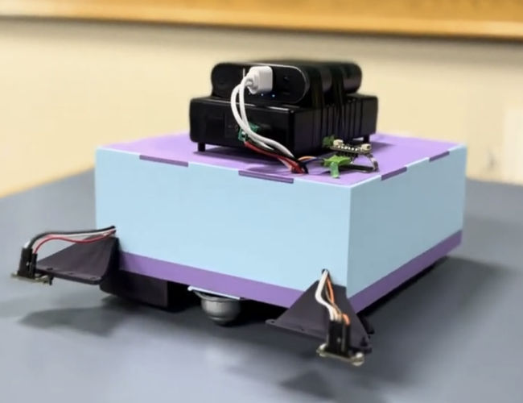
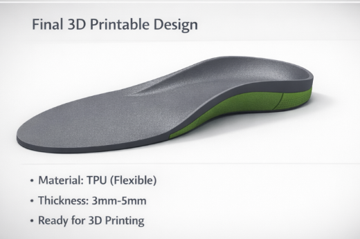
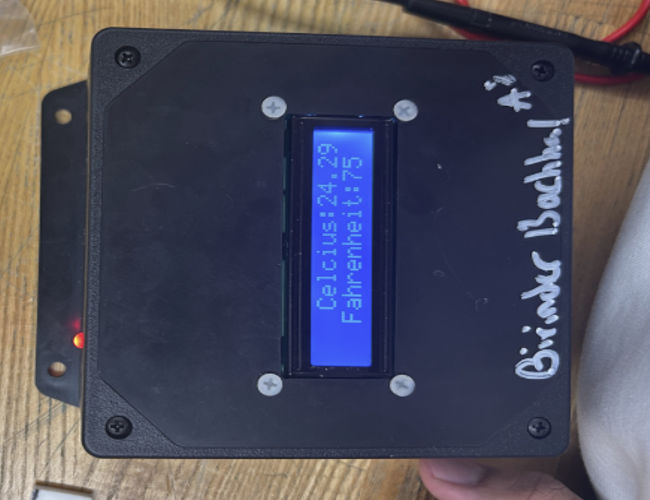

Hi! My name is Birinder Bachhal, and I am a second-year undergraduate at Boston University studying Mechanical Engineering with concentrations in Manufacturing and Robotics. I am especially interested in medical devices and wearable technologies, where mechanical design, electronics, and real-world constraints intersect.

Through project team and self-directed work, I have experience in CAD-driven design, prototyping, motion analysis, and system integration, with an emphasis on iterative testing and reliability. I enjoy building systems that interact with the physical world and perform consistently under real constraints, particularly in safety- and user-critical applications. I am currently developing projects focused on assistive technology and human-interactive systems, where performance, safety, and usability are equally important. I value hands-on prototyping, testing, and iterative improvement as core components of the engineering process, and I strive to incorporate these principles into every academic and professional endeavor.

## Projects

---

### [Autonomous F1Tenth Race Car: Implementing Effective Mechanical Design, Hardware Integration, LIDAR and Computer Vision for Dynamic Path-Planning and Real-Time Obstacle Navigation for a Competitive Autonomous Race Car](./projects/rss/rss)

This project involved the development of an autonomous race car for Boston University’s F1Tenth Project Team, integrating electromechanical hardware, LiDAR sensing, and real-time control systems. I developed a Gaussian-based path-planning and control algorithm to generate stable, physically achievable steering and speed commands under competitive conditions.

---

### [The Deskinator: An Autonomous Desktop-Cleaning Robot](./projects/stgcn_exploration_project/stgcn_exploration_project)

Designed and built an autonomous desktop-cleaning robot by integrating electromechanical hardware, sensing, and real-time control. Implemented EKF-based SLAM to enable reliable localization and repeatable full-surface coverage without external markers. 

---

### [OrthoCAD Pro](./projects/kdtree/kdtree)

Designed and implemented a fully parametric orthotic design system that converts biomechanical inputs into patient-specific, manufacturable CAD geometries. The system automates orthotic generation while enforcing biomechanical intent and manufacturing constraints. 

---

### [Room Temperature Monitoring System: An embedded system design integrating sensing, control logic, and manufacturable hardware](./projects/fys/fys)

Designed and built a standalone embedded temperature monitoring system integrating sensing, control logic, and manufacturable hardware. The system provides real-time display and alert functionality through a microcontroller-based architecture.

---

###  [ECG Signal Processing and Heart Rate Variability Analysis: Biomedical Signal Analysis using MATLAB](./projects/ldsp_embeddings/ldsp_embeddings)

Analyzed real-world ECG data in MATLAB to study how resting, post-exercise, and controlled-breathing conditions affect heart rate variability. Developed signal-processing and feature-extraction algorithms to quantify cardiac cycle dynamics and visualize physiological changes.

[_back to top_](#)

---

## CAD Projects

### [CAD Projects](./projects/CAD/CAD)

This section highlights a collection of CAD models and drawings focused on parametric design, manufacturability, and system-level thinking. Each of these projects emphasizes robust geometry, clear-design intent, and practical constraints such as assembly, tolerances, material behavior, and production methods. All of these projects were completed on SolidWorks 2025.

---

## Coursework

**CAD and Machine Components: SolidWorks**</a> - a junior-level course on CAD modeling done through solidworks that helps students visualize and design manufacturable parts using a parametric designing system. 

**Engineering Mechanics**  - Studied the analysis of forces, moments, and equilibrium in structures and mechanical systems. Gained proficiency in free-body diagrams, trusses, beams, and frictional systems, applying principles of vector mechanics to solve real-world static equilibrium problems. Developed problem-solving skills in both analytical and computational contexts.

**Probability and Data Statistics** - Studied probability theory, random variables, and statistical inference with applications to engineering problems. Developed skills in data analysis, hypothesis testing, regression, and probabilistic modeling to interpret and make decisions from real-world data.

**Introduction to Engineering Design** - Explored the fundamentals of the engineering design process, including problem definition, ideation, prototyping, and iterative testing. Gained hands-on experience in CAD modeling, fabrication, and team-based project development while emphasizing creativity, functionality, and design optimization.

**Multivariable Calculus** - Studied calculus of functions of several variables, including partial derivatives, multiple integrals, vector fields, and gradient, divergence, and curl operations. Applied these concepts to solve engineering and physical science problems involving optimization, motion, and field analysis.

**Computational Linear Algebra** - Studied matrix theory, vector spaces, and linear transformations with a focus on computational methods. Applied numerical algorithms for solving linear systems, eigenvalue problems, and singular value decomposition using programming tools to address engineering and data-driven applications.

[_back to top_](#)
