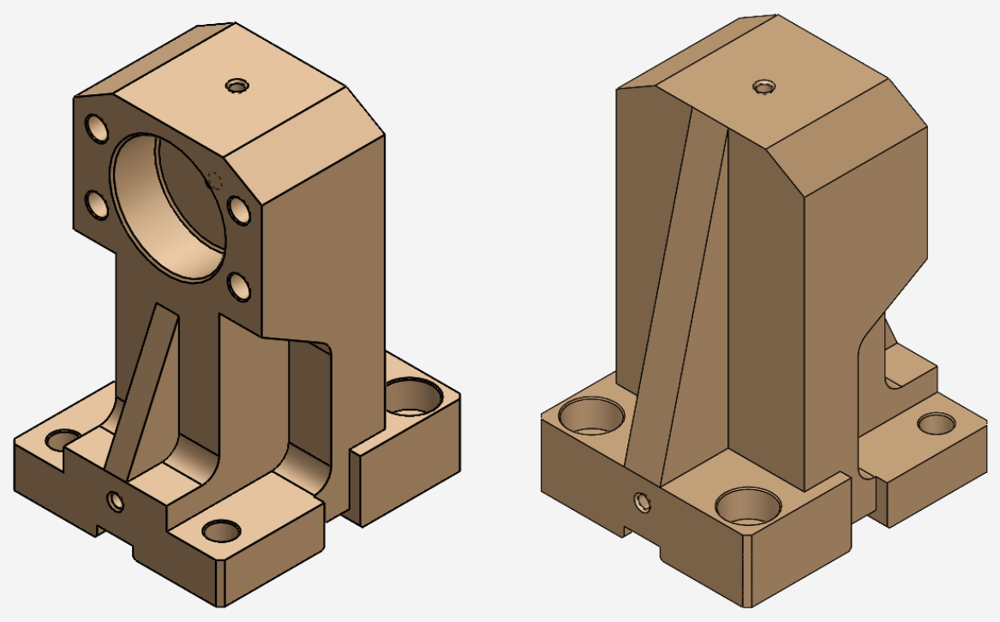
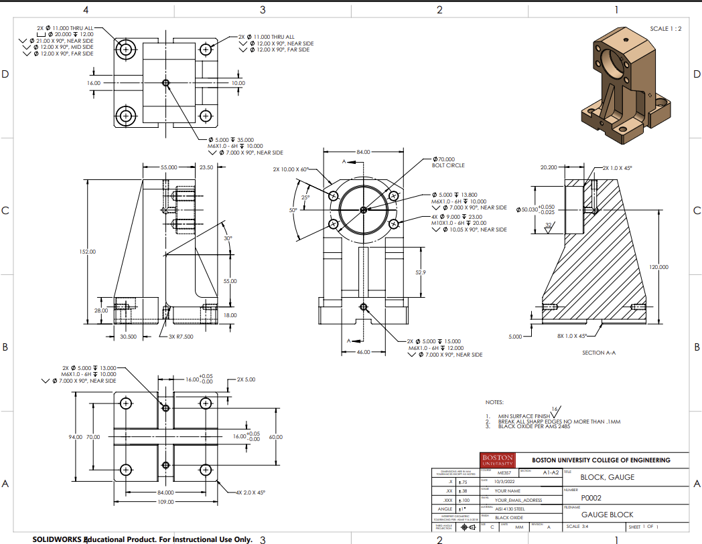
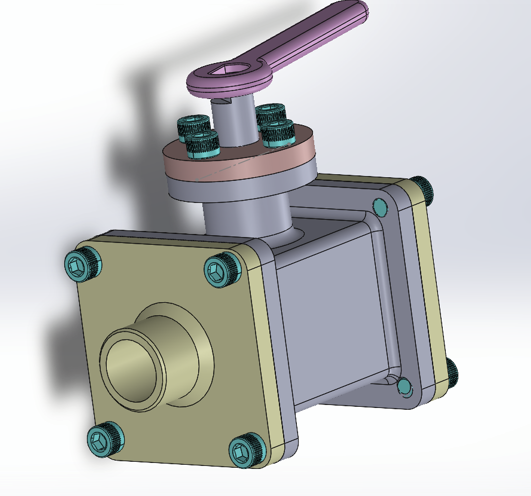
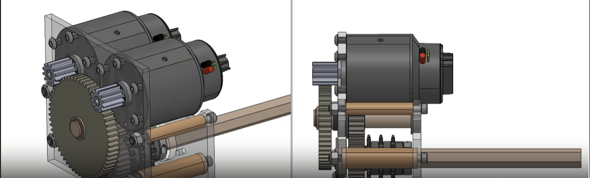
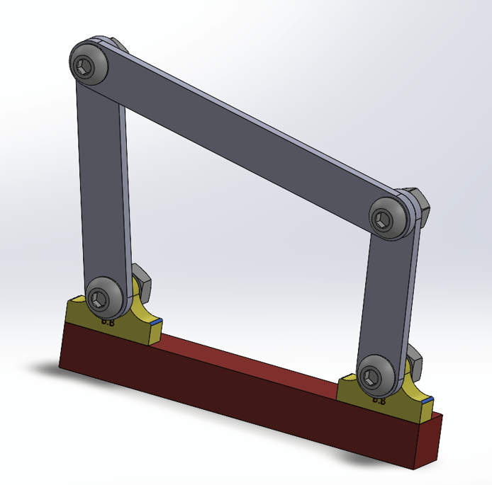
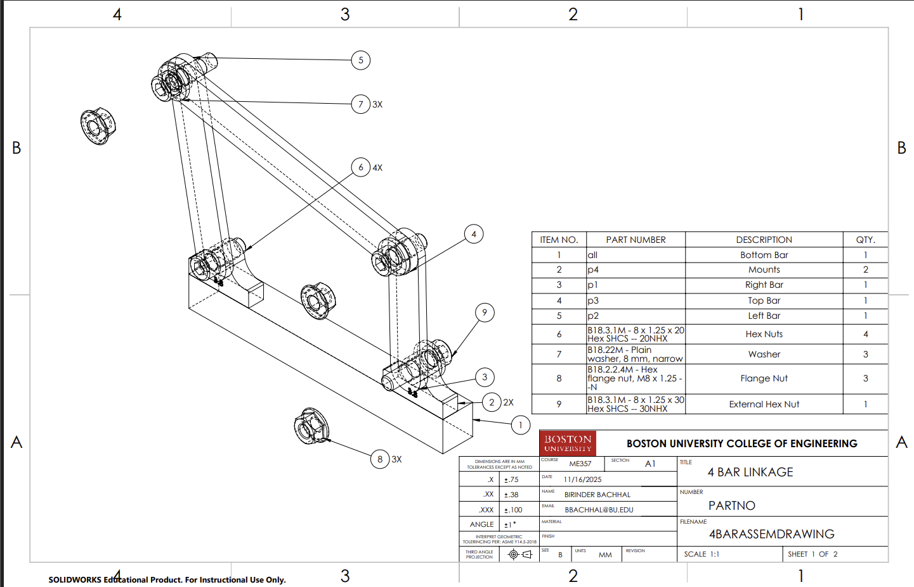
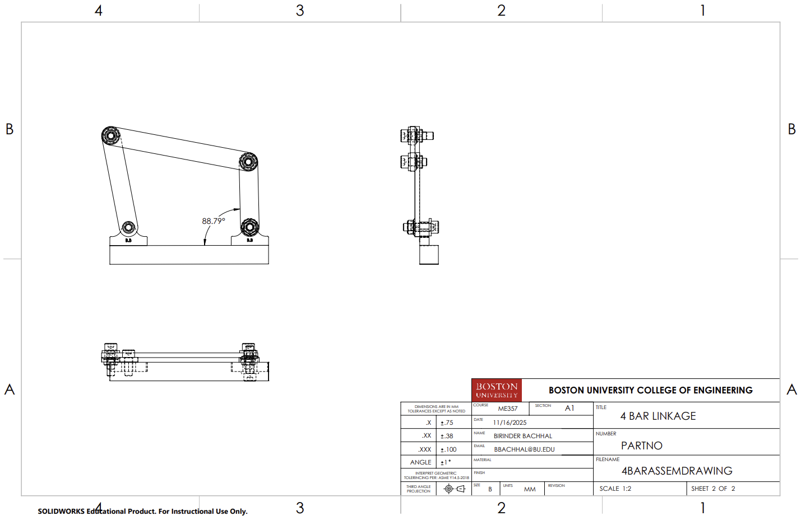

#  CAD Projects
## All CAD projects that I have completed focused on parametric design, manufacturability, and system-level thinking. 

---

## Project 1: Gauge Block Model/Mounting Bracket for Shaft Support

 

Figure 1: Image of Gauge Block Model created on SolidWorks

 

Figure 2: Drawing of Gauge Block model also on SolidWorks

Overview: This component is a structural shaft support and bearing housing designed to rigidly locate a rotating shaft while resisting bending moments and vibrations from cantilevered loads. The rib-reinforced body, thickened bore region, and wide mounting base emphasize stiffness, alignment, and manufacturability, making the part suitable for CNC-machined automation, robotics, or drivetrain applications.

## Project 2: Ball Valve 

 

Figure 1: Image of Ball Valve model created on SolidWorks

Overview: This project models a mechanical ball-valve assembly designed to regulate fluid flow through rotational actuation of a spherical valve element. The design emphasizes precise sealing surfaces, accurate component fit, and manufacturability, demonstrating an understanding of fluid control mechanisms, tolerances, and assembly-level design.

## Project 3: Gearbox 

 

Figure 2: Image of Gearbox drawing on SolidWorks

Overview: This project models a compact enclosed gearbox designed to transmit and reduce rotational motion through an internal gear train housed within a rigid, bolted enclosure. The design emphasizes shaft alignment, load containment, and serviceable assembly, incorporating features such as reinforced housing, flanged covers, and accessible fasteners suitable for CNC manufacturing.

The external handle drives an internal shaft connected to the gear set, demonstrating torque transmission, bearing support, and mechanical power flow within a sealed system. The enclosure geometry, fastener placement, and modular covers reflect careful consideration of manufacturability, maintenance, and structural stiffness for industrial and robotic applications.. 

## Project 4: 4-Bar Linkage

 

Figure 1: Image of 4-Bar Linkage model created on SolidWorks 

 
 

Figure 2: Image of a 4-Bar Linkage drawings created on SolidWorks

Overview: This project models a planar four-bar linkage designed to convert rotary input motion into a constrained output trajectory through a system of pinned rigid links. The mechanism demonstrates an understanding of kinematic constraints, link length selection, and joint articulation, which are fundamental to mechanical motion design in robotics and machinery.

The design emphasizes accurate joint alignment, manufacturable link geometry, and realistic pin interfaces, reflecting careful consideration of tolerances, assembly, and repeatable motion. Such mechanisms are commonly used in robotic arms, suspension systems, and automated tooling, where predictable motion profiles are essential. The project also provided practical experience with SolidWorks motion study and simulation features, particularly for analyzing four-bar linkage kinematics.

