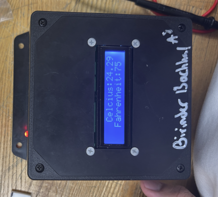
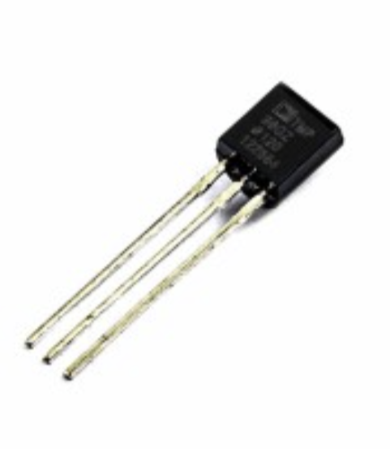
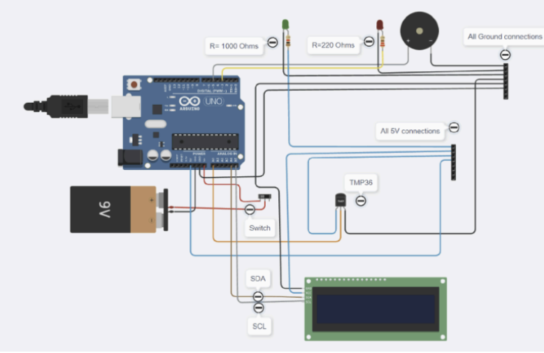
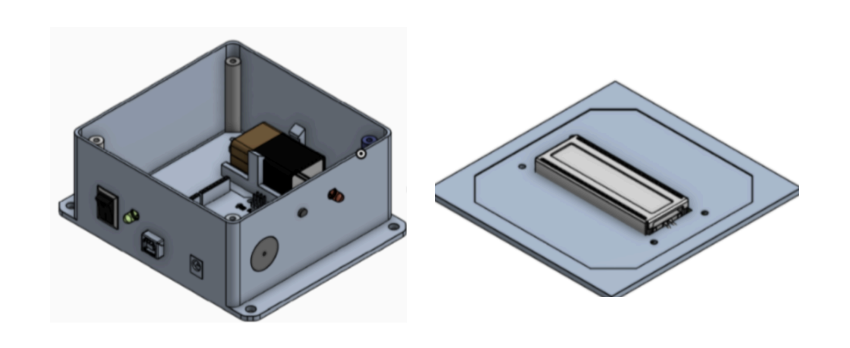
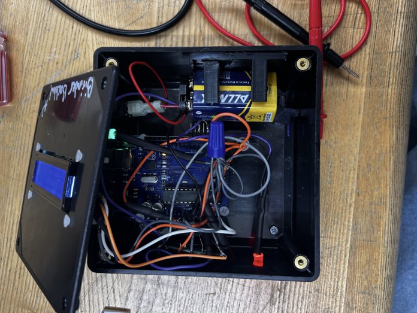

# Room Temperature Monitoring System
### Embedded system design integrating sensing, control logic, and manufacturable hardware. 

Access the full technical report [here](https://docs.google.com/document/d/1Tuv2J6dJECbJdlIxamwfsLFoS41idi5W9Qwg7ItneGM/edit?usp=sharing)! 
---

## Overview and Motivation

This project was developed to explore how a simple, reliable embedded system can be designed to continuously monitor environmental conditions and provide clear real-time feedback. The motivation was to move beyond simulations or isolated circuits and build a fully integrated hardware system, emphasizing correct component selection, electrical safety, manufacturable wiring, and enclosure integration. By designing the system end-to-end, the project highlights the practical engineering decisions required to translate sensing and control logic into a dependable physical product.

On a personal note, this project served as a foundational stepping stone for tackling more complex engineering projects, including the Deskinator and the F1Tenth Autonomous Racecar. The process involved challenges in wiring, coding, and mechanical integration, which I consider essential learning experiences. By the time the project was completed, I was proud of its quality and now regard it as one of the most important projects of my undergraduate engineering career.

---
## System Architecture and Embedded Control

The system is built around an Arduino Uno microcontroller, which serves as the central controller for sensing, computation, and output logic. An analog TMP36 temperature sensor provides a voltage proportional to ambient temperature, which the Arduino reads via its ADC and converts into both Celsius and Fahrenheit values in software.

Real-time temperature readings are displayed on a 16×2 I²C LCD, while embedded logic continuously evaluates whether the measured temperature falls outside the defined 80–90 °F “safe” range. When thresholds are exceeded, the Arduino activates a red LED warning indicator and a piezo buzzer to provide immediate feedback to the user.

Figure 1: Image of the TMP36 Temperature Sensor, a primary component of the Room Temperature Monitor

## Electrical Design and Wiring Implementation

I designed and assembled the full electrical system with a focus on clarity, reliability, and safety. Power and signal lines were organized using 22 AWG solid-core wiring, and durable connections were ensured with heat shrink tubing, twist caps, and spade connectors. A consistent color-coding scheme simplified debugging and maintenance following preliminary testing. I also integrated an on/off switch and a battery clip for standalone operation. The system is powered by a 9 V battery, supplying the Arduino within its supported input range while allowing portable, untethered use.

Figure 2: A complete schematic of the wiring done on each hardware component of the final project. 

## Component Selection and Electrical Calculations

Selecting hardware components was one of the first steps before manufacturing the electromechanical design of the system. All choices were guided by electrical constraints and reliability considerations for the final temperature monitor. The TMP36 sensor was chosen for its linear voltage-to-temperature response, wide operating range, and compact size, enabling portability for the system. Resistors were sized using Ohm’s law to protect the LEDs: the green LED used a 1 kΩ resistor, and the red LED used a 220 Ω resistor. These calculations and implementations ensured that all components operated within safe current and voltage limits for continuous use with a 9 V battery.

The total system current draw was measured at approximately 80 mA, yielding an estimated 9.5 hours of continuous operation. This exceeded preliminary design calculations, demonstrating the effectiveness of the improvements made during the design process.

## Mechanical Integration and Enclosure Design

All hardware components were housed in a 3D-printed ABS enclosure, including a dedicated acrylic mounting plate for the Arduino and LCD fabricated using an Epilog Laser Cutter, internal battery holders and wiring channels made of 3D-printed PLA, and secure fasteners using screws and right-angle connectors. This design ensured mechanical protection, consistent component placement, and a clean final assembly suitable for repeated handling and testing. The completed product was a fully functional and aesthetically pleasing room temperature monitor.

All CAD designs were created in OnShape. I chose OnShape due to accessibility at the time; I only gained access to SolidWorks and AutoCAD after completing this project. In retrospect, SolidWorks or AutoCAD would likely have simplified the design process and offered additional functionality for this project.

Figure 3: Final CAD Model of the enclosure and the enclosure lid. Inside the enclosure is the 9V battery holder, and the Arduino Uno mounting plate. On the enclosure lid is the 16x2 I2C LCD screen. 

## Testing, Performance and Validation

The completed prototype was validated through repeated testing, demonstrating accurate real-time temperature readings, reliable LCD updates in both Celsius and Fahrenheit, consistent alarm activation outside the 80–90 °F range, and stable electrical operation at a 5 V internal logic level. Some limitations of the project included the enclosure size; while I had hoped for a more compact design, rearranging the internal components could have compromised wiring organization and clarity. Additionally, environmental exposure of the TMP36 sensor may introduce errors over long-term use. Future improvements could include selecting a sensor more resistant to environmental conditions or implementing shielding to enhance measurement reliability.

Figure 4: Final image of the internal component of the Room Temperature Monitoring System

Figure 5: Final image of the entire Room Temperature Monitoring System (Celsius is spelled wrong simply due to an inside joke that was made during the creation of the project!)

[*back to top*](#)
