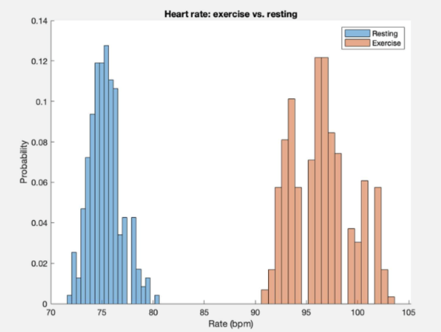

# ECG Signal Processing and Heart Rate Variability Analysis
### Biomedical Signal Analysis using MATLAB

---

## Overview and Motivations

This project investigates how physiological states influence cardiac behavior by analyzing real-world electrocardiogram (ECG) data. Using MATLAB, I processed and analyzed three-lead ECG recordings collected under resting, post-exercise, and controlled-breathing conditions to quantify changes in heart rate variability (HRV) and cardiac cycle dynamics.

As a student interested in medical technologies, I aimed to explore areas in medicine where engineering and device development could have impact. One focus was heart rate variability, an important indicator of autonomic nervous system activity and cardiovascular health. Subtle changes in HRV are often obscured by noise and variability in real-world ECG data. This project was motivated by the challenge of extracting reliable physiological insights from raw biosignals using robust signal processing and quantitative analysis, rather than relying on idealized or preprocessed datasets.

## Data Acquisition and Experimental Conditions

ECG data were collected from human subjects using a three-lead configuration, providing sufficient resolution to analyze waveform morphology and timing. Recordings were obtained across three conditions: resting baseline, immediately following physical exertion, and during box breathing to induce controlled respiratory modulation. These conditions enabled direct comparison of autonomic responses and cardiac dynamics.

## Signal Processing and Feature Extraction

I developed a MATLAB-based signal processing pipeline to clean and analyze the ECG signals. This included signal smoothing and noise reduction to improve waveform clarity, peak detection algorithms to identify R-peaks and segment cardiac cycles, and feature extraction of P waves, QRS complexes, and T waves, correlating electrical activity to atrial and ventricular function. The pipeline was designed to balance sensitivity and robustness, ensuring accurate detection across varying heart rates and signal quality.

## Heart Rate Variability Analysis

Heart rate variability (HRV) was quantified by calculating RR intervals between successive heartbeats. Changes in HRV were analyzed across conditions to evaluate the effects of exercise-induced stress and controlled breathing on cardiac rhythm. This analysis revealed measurable differences in beat-to-beat variability, highlighting the physiological impact of both exertion and respiratory control.
