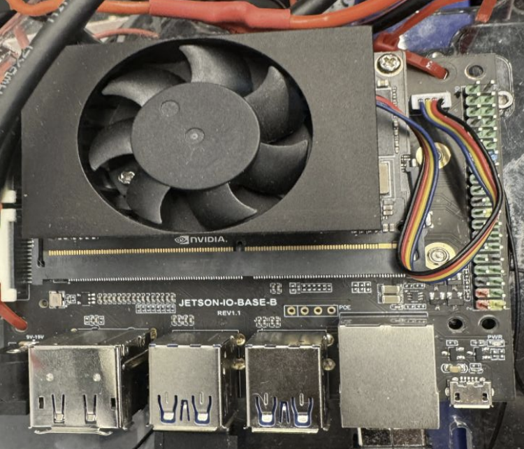
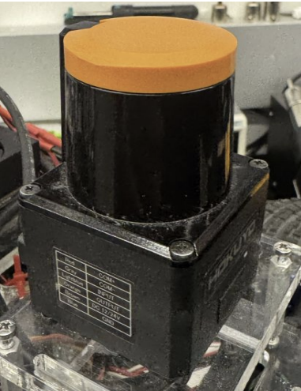
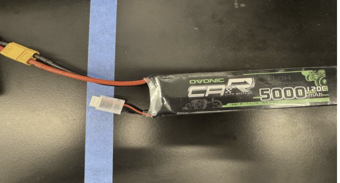
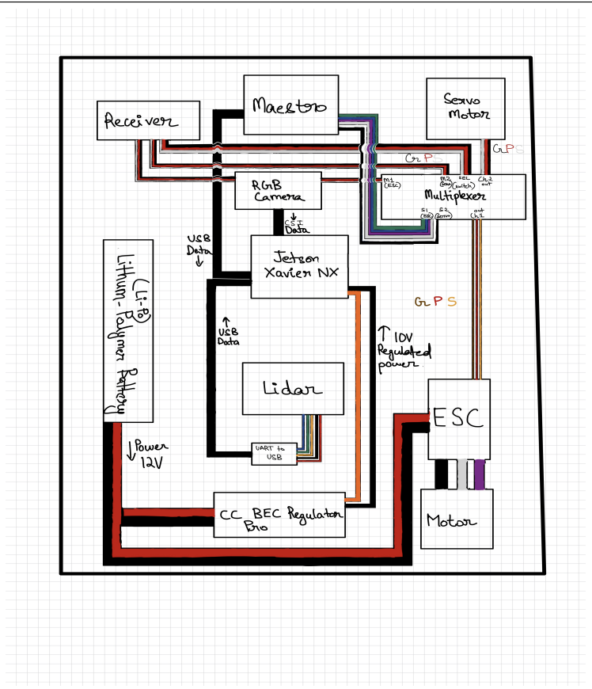
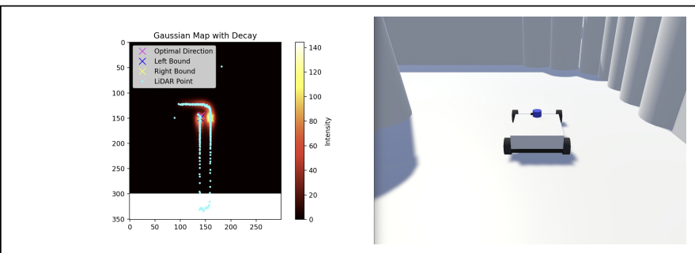
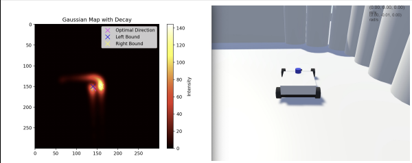

# Autonomous F1Tenth Race Car 
### Implementing Effective Mechanical Design, Hardware Integration, LIDAR and Computer Vision for Dynamic Path-Planning and Real-Time Obstacle Navigation for a Competitive Autonomous Race Car

**Figure 1**: The BU F1Tenth Autonomous Race Car in Action!

---

## Project Description

I worked on the development of a 1:10 scale autonomous race car as part of Boston University’s F1Tenth Autonomous Car Racing Organization, a hands-on robotics and autonomous systems project team integrating electromechanical design, sensing, and control. The goal of the project was to design, assemble, and iterate on a fully functional autonomous vehicle capable of navigating competitive race tracks using onboard sensing and real-time control.

As an Executive Board Member and project lead for hardware at BU F1Tenth, my experience focused primarily on the electromechanical design of the platform and the physical manufacturing of its components. I also participated extensively on the software side, gaining experience with LiDAR and computer vision to enable dynamic path planning and real-time obstacle navigation for our competitive platform. 

***Find information about our team here! <a href="https://www.buf1tenth.com/" target="_blank">here</a>.***

---
## Electromechanical Design and Wiring Architecture

I was responsible for designing and implementing the electromechanical system and wiring architecture for an autonomous race car, selecting and integrating compute, sensing, power, and actuation components with a focus on reliability, serviceability, and real-world performance.

**Figure 2**: Overview of the electromechanical design and wiring of the vehicle's body including the chassis and the layout of various hardware components

**Figure 3**: CAD model of the mounting baseplate of the vehicle which housed all of the hardware components and fit within the constraints of the designed chassis. 

I designed and assembled the full wiring harness, routing power and signal lines to minimize electrical noise, reduce mechanical strain, and improve accessibility for debugging and maintenance. Special attention was given to connector selection, cable management, strain relief, and vibration resistance, ensuring consistent performance during high-speed operation. Early in the electromechanical design process, the main challenge was developing an electrical framework capable of sustaining the extreme speeds of the vehicle.

For compute and control hardware, I selected the NVIDIA Jetson NX as the primary compute module due to its ability to support real-time LiDAR processing and future vision-based autonomy, while remaining compact enough for our 1:10 scale vehicle. The compute unit was integrated with careful consideration for thermal exposure, vibration isolation, and serviceability, particularly after a Jetson failure during testing highlighted the importance of robust mounting and rapid replacement strategies.

**Figure 4**: Image of NVIDIA Jetson NX 

For perception, we used the Hokuyo UST-10LX 2D LiDAR, selected for its lightweight form factor, precise scanning, and suitability for fast dynamic obstacle detection in competitive environments. Its placement and wiring were designed to maintain consistent scan geometry while minimizing interference from drivetrain vibration and power electronics.

**Figure 5**: Image of Hokuyo UST-10LX 2D LiDAR

Initial testing revealed that powering all subsystems from a single battery introduced electrical instability and inconsistent performance. To address this, we redesigned the power architecture to split the system across two battery sources, significantly improving electrical stability and reducing stress on sensitive components. A Gens Ace 3S 11.1 V 5000 mAh LiPo battery was selected as the primary energy source due to its high current-delivery capability and endurance under sustained load. Supporting components included a CC BEC Pro switching regulator, which ensured stable voltage delivery to control electronics while isolating them from motor noise.

**Figure 6**: Image of Gens Ace 3S 11.1 5000 mAh LiPo battery 

**Figure 7**: Image of Final Wiring Architecture and Design

---

## Autonomous Path Planning and Real-Time Navigation

Although most of my time was dedicated to the electromechanical design and hardware integration of the vehicle, I also contributed to the path-planning and autonomous navigation pipeline for the F1Tenth race car, focusing on translating LiDAR-based perception into real-time, physically executable motion commands under dynamic and competitive conditions.

Our existing control logic, however, underperformed at speeds exceeding 20 mph. To address this, we developed and iterated a new control approach using Gaussian-based direction selection and a simple Gaussian-based path-planning algorithm. This algorithm processes LiDAR scan data and assigns directional "weights" across the vehicle’s forward field of view. Unlike our previous approach, which selected paths based on single minimum-distance measurements, the new method models free space using Gaussian distributions, favoring wider, safer openings while naturally smoothing noisy sensor data.

This approach offered several advantages, including robustness to spurious LiDAR readings, smoother directional outputs that reduce abrupt steering changes, and improved stability at high speeds, especially in narrow or cluttered track sections. The Gaussian weighting effectively transformed raw LiDAR distances into a continuous cost landscape, enabling more precise and reliable direction selection under faster racing conditions with dynamic obstacles and sharper turns.

**Figure 8: This displays the Gaussian heatmap shown with our simulation on the right. The map also displays the LiDAR distance points from the car's latest sensor readings, demonstrating how the Gaussians collectively form a "map" of the track, similar to the way LiDAR points create a spatial representation. 

**Figure 9:** This displays just the Gaussian heatmap without the LiDAR points. The car is approaching a left turn and so the map displays an abundance of read markers on the right side and directly ahead of the car, indicating an obstacle there. It also shows there's an open area on the left side, free from any Gaussian intensities, repreesnting the optimal path to take. 

In summary, our new control algorithm built on the Gaussian planner’s output. Rather than issuing aggressive or discontinuous commands, the control logic scaled steering based on curvature and vehicle speed, and adjusted throttle to maintain stability through tight turns while reducing oscillations caused by overcorrection or sensor noise. This ensured that planned trajectories were not only optimal in theory but also physically achievable by the vehicle, accounting for actuator responses, steering limits, and traction constraints on the track.

[*back to top*](#)
