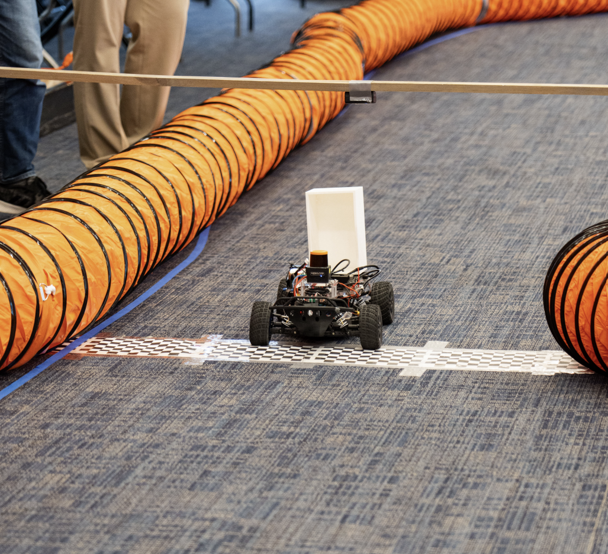
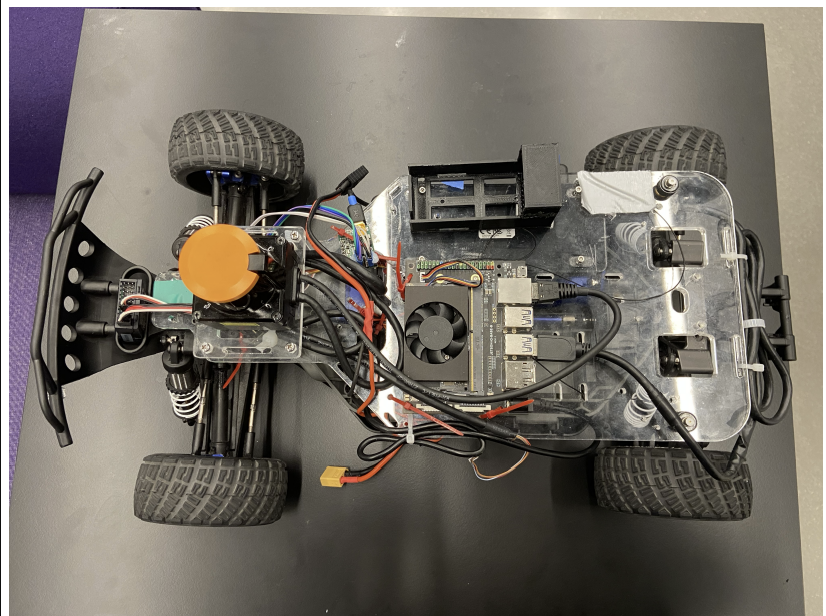
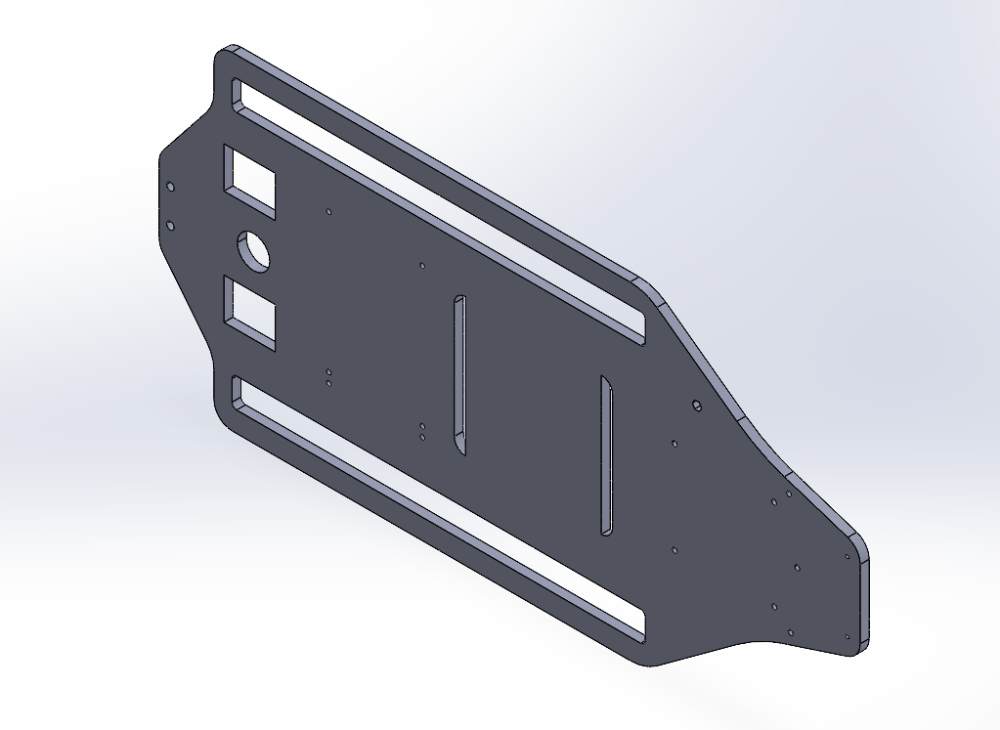
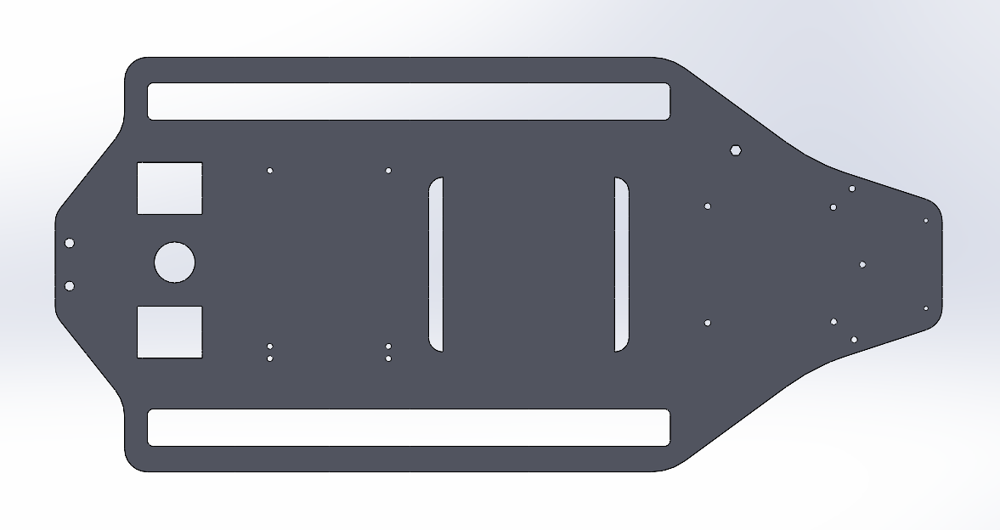

# Autonomous F1Tenth Race Car 
### Implementing Effective Mechanical Design, Hardware Integration, LIDAR and Computer Vision for Dynamic Path-Planning and Real-Time Obstacle Navigation for a Competitive Autonomous Race Car

**Figure 1**: The BU F1Tenth Autonomous Race Car in Action!

---

## Project Description

I worked on the development of a 1:10 scale autonomous race car as a part of Boston University's F1Tenth Autonomous Car Racing Organizazation, a hands-on robotics and autonomous systems project team that integrates electromechanical design, sensing, and control. The overall goal for this project was to design, assemble, and iterate on a fully-functional autonomous vehicle capable of navigating competitive race tracks using onboard sensing and real-time control. As an Executive Board Member and the project-lead for hardware for BU F1Tenth, most of my experience resides in the electromechanical design of the platform as well as the physical manufacturing of components on the platform. However, I did participate quite extensively on the software side of things, where I learned about and helped leverage LIDAR and computer vision for dynamic path-planning and real-time obstacle navigation for our compeittive platform. 

***Find information about our team here! <a href="https://www.buf1tenth.com/" target="_blank">here</a>.***

---
## Electromechanical Design and Wiring Architecture

I was responsible for designing and implementing the electromechanical design and wiring architecture for an autonomous race car, selecting and integrating compute, sensing, power, and actuation components with a focus on reliability, serviceability, and real-world performence. 

**Figure 3**: Overview of the electromechanical design and wiring of the vehicle's body including the chassis and the layout of various hardware components

**Figure 4**: CAD model of the mounting baseplate of the vehicle which housed all of the hardware components and fit within the constraints of the designed chassis. 

I designed and assembled the full wiring harness, routing power and signal lines to minimize electrical noise, reduced mechanical strain, and improve accesibility for debugging and maintenence. Most of my special attention was given to connector selection, cable management, strain relief, and vibration resistance, ensuring consistent performence during our high-speed operation. Early on during the electromechanical design process, most of the issues I ran into included understanding how to create an electrical framework which could sustain the extremely high speeds that our vehicle would move at. 

In terms of Compute and Control Hardware, I chose to use the NVIDIA Jetson NX as the primary compute module due to its ability to support real-time LIDAR processing and future vision-based autonomy, while also remaining compact enough to fit in our 1:10 scaled vehicle. The compute unit was integrated with attention to thermal exposure, vibration isolation, and serviceability, particularly after experiencing a Jetson failure during testing, which reinforced the need for robust mounting and rapid replacement strategies. 

**Figure 4**: Image of NVIDIA Jetson NX 

For perception, we used the Hokuyo UST-10LX 2D LiDAR, chosen simply because of its lightweight form factor, preciseness with its scans, and suitability for faast dynamic obstacle detection in competitive environments. Its placement and wiring  were designed to maintain consistent scan geometry while minimizing inteference from drivetrain vibration and power electronics. 

**Figure 5**: Image of Hokuyo UST-10LX 2D LiDAR

Initial testing revealed that powering all subsystems from a single battery introduced electrical instability and inconsistent performence. To address this, we redesigned the power architecture to split the system across two battery sources, significantly improving electrical stability and reducing stress on sensitive components. For this a Gens Ace 3S 11.1V 500 mAh LiPo battery was selected as the primary energy source due to its current-delivery capability and enduracne under a sustained load. Supporting components including a CC BEC Pro switching regulatar, which was used to ensure stable voltage delivery to control electronics while isolating them from motor noise. 

**Figure 6**: Image of Gens Ace 3S 11.1 5000 mAh LiPo battery 

**Figure 7**: Image of Final Wiring Architecture and Design

## Autonomous Path Planning and Real-Time Navigation

Although most of my time was dedicated directly towards the electromechanical design and hardware integration of the vehicle, I contributed time towards the path planning and autonomous navigation pipeline for the F1Tenth race car, focusing on translating LiDAR-based perception into real-time, physically executable motion commands under dynamic and competitive conditions. 

However, our existing control logic did not meet our expectations when we ran our vehicle at speeds exceeding 20 mph. Therefore, we had to iterate and experiment with new control logic that consisted of Gaussian-based direction sleection and a simple Gaussian-based path planning algorithm. This processed LiDAR scan data and assigns directional "weights" across the vehicle's forward field of view. Instead of selecting a path based on a single minimum-distance measurement, as our existing algorithm did, the new algorithm models free space using Gaussian distributions, allowing the planner to favor wider, safer opening while naturally smoothing noisy sensor data. 

This approach provided several advantages including noise robustness against spurious LiDAR readings, smooth directional outputs, reducing abrupt steering changes, improved stability at speed, especially in narrow or cluttered track sections. This gaussian weighting effectively trasnformed our raw LiDAR distances into a continious cost landscape, creating more precise and reliable direction selection under much faster racing conditiions, with more dynamic obstacles including much more sharper turns and patterns to follow. 

**Figure 8: This displays the Gaussian heatmap shown with our simulation on the right. The map also displays the LiDAR distance points from the car's latest sensor readings, demonstrating how the Gaussians collectively form a "map" of the track, similar to the way LiDAR points create a spatial representation. 

**Figure 9:** This displays just the Gaussian heatmap without the LiDAR points. The car is approaching a left turn and so the map displays an abundance of read markers on the right side and directly ahead of the car, indicating an obstacle there. It also shows there's an open area on the left side, free from any Gaussian intensities, repreesnting the optimal path to take. 

So, in summary, our new control algorithm built on the Gaussian planner's output.  Rather than issuing agressive or discontinuous commands, the control logic scaled steering commands based on curvature and vehicle speed, adjusted throttle output to maintain stability through tight turns, reduced oscillations caused by overcorrection or sensor noise.  All of this ensured that planned trajectories were not just optimal in theory, but physically achievable by the real vehicle, accoutnign for all actuator responses, steering limits, and traction constraints on the track. 

[*back to top*](#)
