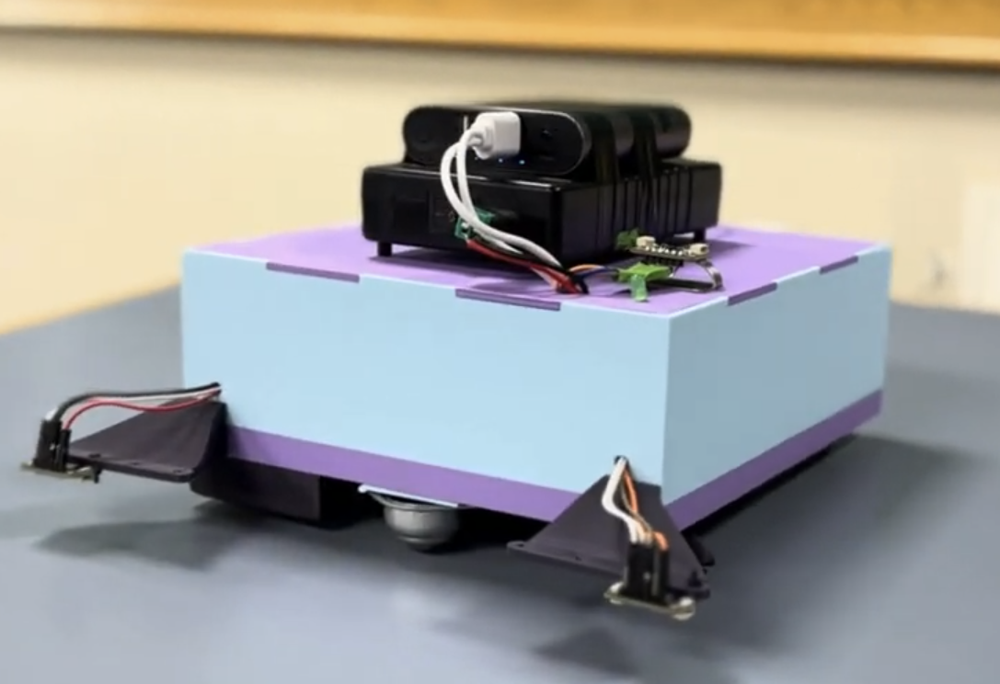
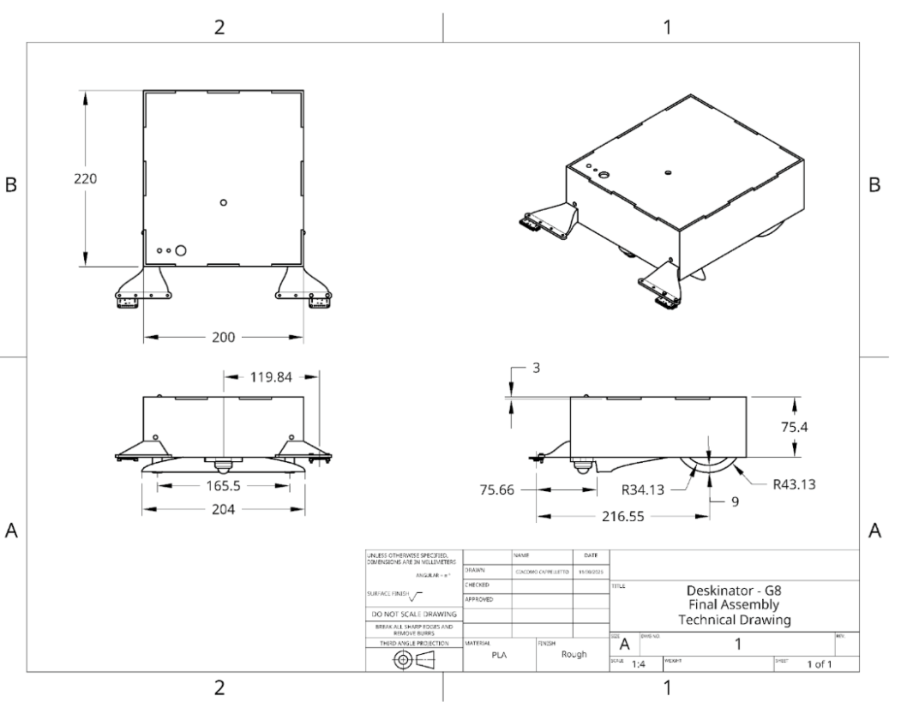
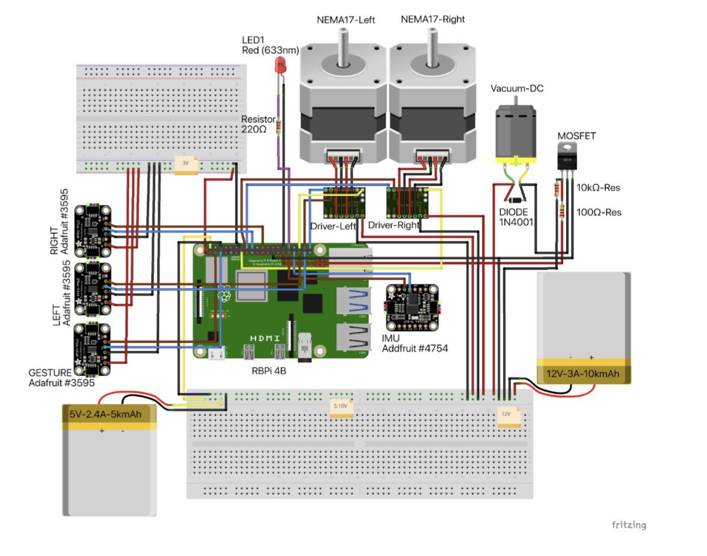
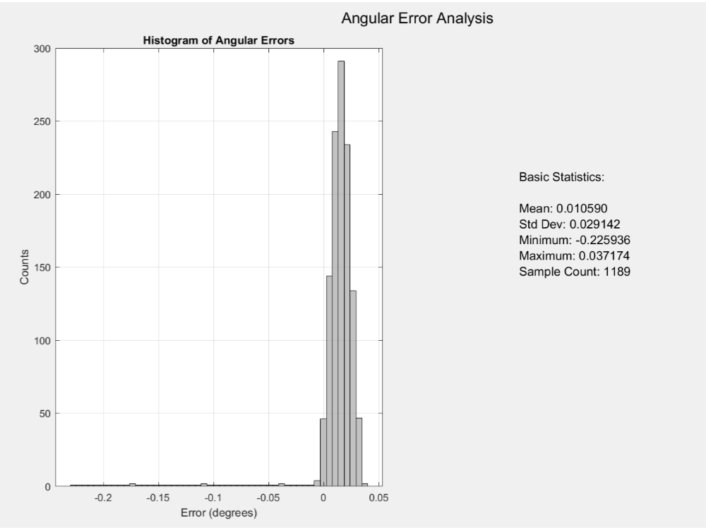
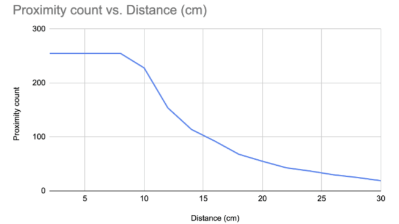
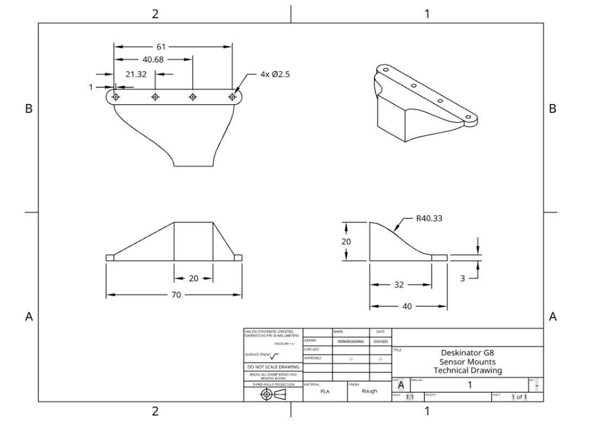
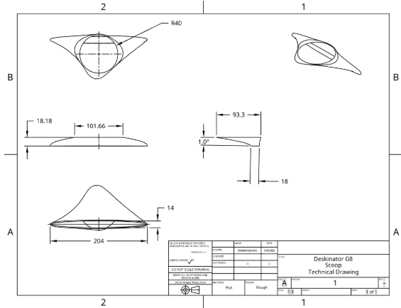
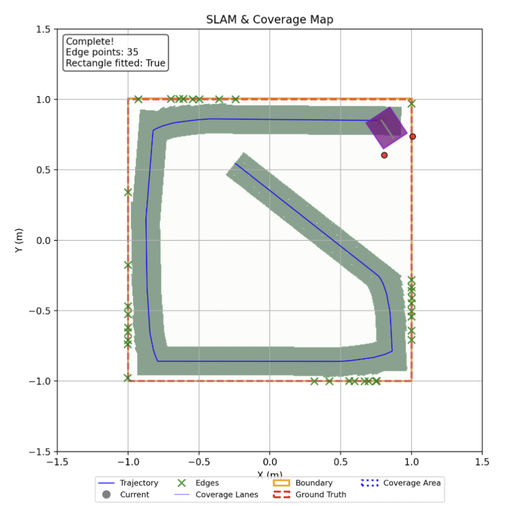
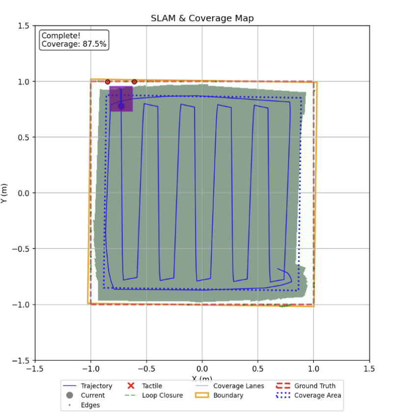
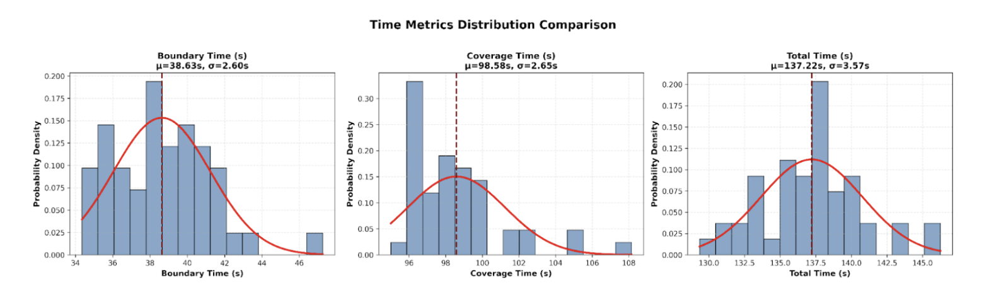

# The Deskinator
### An Autonomous Desktop-Cleaning Robot
Role: Mechanical and Robotics Systems Lead
Focus: Electromechanical Design, Motion Systems, Embedded Hardware, Autonomous Navigation

Access The Deskinator Video [here](https://drive.google.com/file/d/17UYgUKBP8n6Xr2Mj3MLHvpmgbl_ftx7z/view?usp=sharing)! 

Access the full technical report [here](https://docs.google.com/document/d/1J7fj0Xwd_tkpN8rXVOZPwmj2ORiROpX2GtS6bQvDz3A/edit?usp=sharing)! 
---

## Overview and Motivations

This project explores how an autonomous electromechanical system can be designed to reliably perform full surface coverage in a constrained, human-facing environment. The Deskinator was build to translate motion planning and auotnomy concepts into a physically robust, low-cost robot, emphasizing safe operation, repeatable performence, and real-world reliability. The motivation behind this project was simple: there is a need to translate theoretical autonomy and motion-planning conepts into physically realizable systems that operate consistently under real-world constraints. As a student, my desk is everything to me. From being a place I can spend my time finishing work for my classes, to the place I eat my lunch and watch my favorite films and YouTube videos. Therefore, the most efficeint and applicable use of an autonomous system for my circumstances was this desktop-cleaning robot, The Deskinator, that we designed. 

By designing, building, and testing a fully autonomous desktop-cleaning robot, this project investigates how electromechanical architecture, motor control strategy, and sensor integration influence system reliability and coverage performence. Beyond demonstrating autonomy, the project emphasizes repeatability, manufacturability, and robustness, bridging the gap between academic robotics concepts and deployable engineering solutions. The findings are relevant not only to autonomous service robotics, but also to manufacturing and product development contexts where consistent performence under real-world variability is essential. 

In summary, the Deskinator is a fully autonomous desktop-cleaning robot designed to safely and efficiently clean desks without human intervention. Operating on a desktop surface, the robot autonomously detects boundaries, plans coverage paths, and removes debris using a custom vacuum system, all within strict time, safety, and cost constraints. 
---
## My Contributions

### Electromechanical Design and Wiring Architecture

I designed and manufactured each mechanical component of the Deskinator, including the chassis, bumper system, vacuum sweep system, wheels, etc. I also designed and implemented the electrical systme for the robot, integrating motors, sensors, power, and compute into a compact, serviceable layout. As seen in Figure 2, I designed the full wiring architecture for all hardware components integrated within the Deskinator. I also integrated dual power rails (12V + 5V) to seperately power high-load actuators and sensitive electronics. With this, I also routed wiring to minimize EMI and mechancial strain during motion, and ensured modularity for debugging, replacement, and testing. All this was done with space contraints, serviceability, noise isolation, and reliability over repeated cycles of testing in mind. 

Figure 3: CAD of Deskinator's Assembly

Figure 2: Full wiring schematic of The Deskinator 

### Motor Selection and Drive System Engineering

I selected and integrated NEMA 17 stepper motors paired with A4988 stepper drivers to achieve precise, repeatable motion while maintaining desk-safe operation. We had to make slight changes from our initial choices for the electromechanical design, specifically when we replaced an initial DC motor + H-bridge design after identifying there was thermal foldback and a loss of microstepping in our NEMA 17. 

We chose the A4988 current-limited drivers because they maintain a stable sinusoidal phase current under a load, and overall, it kept our motors at a stable microstepping limit to better ensure efficient, and precise functionality. When it came to the NEMA 17 motors, we had to do some important testing before we chose them, where testing included running the motors to find their angular error over time. We were looking for repeatability and accuracy, and much of the stepper motors we tested before choosing the NEMA 17 motors didn't achieve an angular error small enoguh for us to safely use them. As shown in Figure 3, the NEMA 17 stepper motors provided us with an extremely small angular error, therefore, we came to the conclusion that these were perfect for our design. 

The result of this combination of Nema 17 stepper motors and A4988 drivers was smooth, jitter-free differential drive motion with reliable odometry for autonomous navigation. 

Figure 3: Preliminary testing of the NEMA 17 stepper motors' angular error. This plot shows simply how precise these motors were, with an error extremely close to 0. Also shown are basic statistics regarding the angular error. 

### Sensor Integration and Embedded Hardware Debugging

Finding sensors required some discussion due to the fact that the precision and accuracy of our sensors is quite literally the most important aspect of our final design. Our SLAM algorithm relies directly to our front-facing sensors to provide the most accurate edge-detection and obstacle-detection for our robot's mobility. Therefore, after testing and experimenting with various infrared and proximity sensors, we decided on using the APDS9960 proximity sensors as our primary edge-detection hardware. Data from the testing done on the APDS9960 is shown in Figure 4. Although edge-detection was the most important application of these sensors, we did use one APDS9960 sensor in our final design for our gesture-based, touchless activation.  As you can see in Figure 5, the APDS9960 sensors were placed on the external "flaps" which reached out from the main frame of the Deskinator to detect the edges of the desktop surface before the body of the Deskinator reaches the edge. The central compute unit for this entire sensor setup was a Raspberry Pi 4B.  

Figure 4: A chart showing the preliminary testing done on the APDS9960 proximity sensor showing the effectiveness of the sensor at various distances from an obstacle. 

 

Figure 5: CAD modeling of the sensor mounts. These flaps are located at the front of the deskinator's main frame. Refer to Figure 1 for their relative placement within the Deskinator assembly.

### Custom Vacuum and Mechanical Integration

Out of everything that I designed on the Deskinator, I believe this was the hardest aspect to design, simply because of the complexity of our designed system. However, our final designed vacuum system was done flawlessly and worked perfectly. Our design consisted of a vacuum scoop system on the bottom of the robots main frame that took suction from a 12V DC vacuum fan and consisted of a custom chute geometry that sucked up the debris and deflected the debris into a removable container at the bottom of the chute system. This is quite hard to describe in words, therefore, please refer to the video linked in the overview section for a better demonstration! 

This sytem helped us achieve our desired accessibility and usability aspect. Our goal was to make the Deskinator as easy as possible to use; without the use of much maintainence, manual movement, and manual control. Our chute system with the detachable container provides us with just that. Through testing, we achieved 99.4% debris removal under the project's cost and weight limits. Figure 6 shows the design of the chute system as seen from the bottom of the robot body.

Figure 6: CAD drawing of the vacuum system on The Deskinator.

### Manufacturing Process

After the design process, I began manufacturing each component on The Deskinator. First I designed the wheels, which were laser cut utilizing an Epilog Laser Cutter/Engraver and stock plywood, then covered with simple rubber tread. Then came the main body of the robot, which was made of 3D printed PLA using an FDM printer. Then came the mounting plate for the hardware, which was made out of acrylic using an Epilog Laser Cutter and each hardware component was fastened with M3 Hex Screws. The flaps on which the proximity sensors were placed, the vacuum system including the chute and the detachable container, the battery holder at the top of the main body, the NEMA 17 mounts, and the fan mounts were all 3D printed PLA using a Bambu Lab FDM printer. All of these manufactured components were made after prototyping each component with cardboard and wood, understanding the effectiveness of their design and trying to see if there's any room for improvement. 

---

## Autonomous Navigation and Coverage Planning

### Localization and SLAM Integration

While hardware and manufacturing focused, I worked closely with the software system to ensure mechanical decisions supported the autonomy being designed for The Deskinator. With this, I also helped with the localization and SLAM pipeline that allowed the robot to estimate its position on the desk in real time and execute repeatable coverage paths. The system combined wheel odometry with IMU data using an Extending Kalman Filter (EKF) to reduce drift and maintain stable pose estimates during operation. 

I was specifically responsible for ensuring the SLAM approach aligned with the robot's mechanical and sensing limitations, including wheel slip, motor resolution, and sensor noise. Through iterative testing, I tuned filter parameters and motion constraints to improve localization stability, enabling the robot to maintain accurate positioning over full cleaning cycles without external markers or beacons. The figures below show some of the testing and simulations done to understand the motion of The Deskinator. 

Figure 7: Example of Wall Follower used to compute boundary based on found edges. This path was our initialization path. 

Figure 8: Example of computed and followed Boustrophedon path. This "lawn-mower" like path was our cleaning path. 

  

Figure 9: Graphs of Distribution of Time to complete boundary, discovery and total times, with Gaussian fitting. 

[*back to top*](#)
